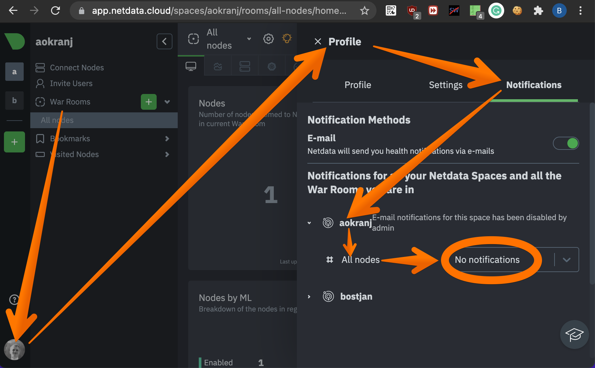

# How to disable (own) notifications from Netdata - Runbook - AO Kranj Infrastructure

Netdata notifications can be disabled at two levels:
* Per-space, for all users in said space (by space admin),
* Per-user, for each individual user (by themselves).

This runbook describes how to disable your own Netdata notifications,
leaving space notifications enabled so that other users can receive them.

## Disable (your own) Netdata notifications

You can disable notifications to you in your Netdata user profile,
in the `Notifications` tab:

